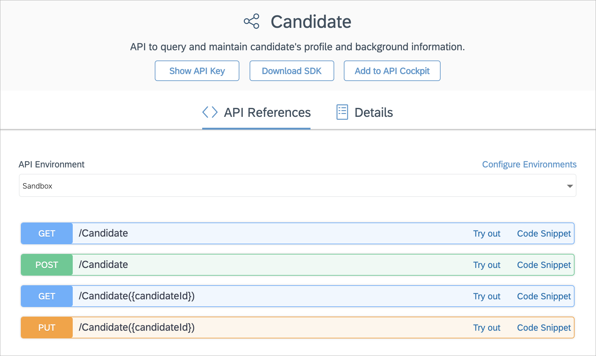
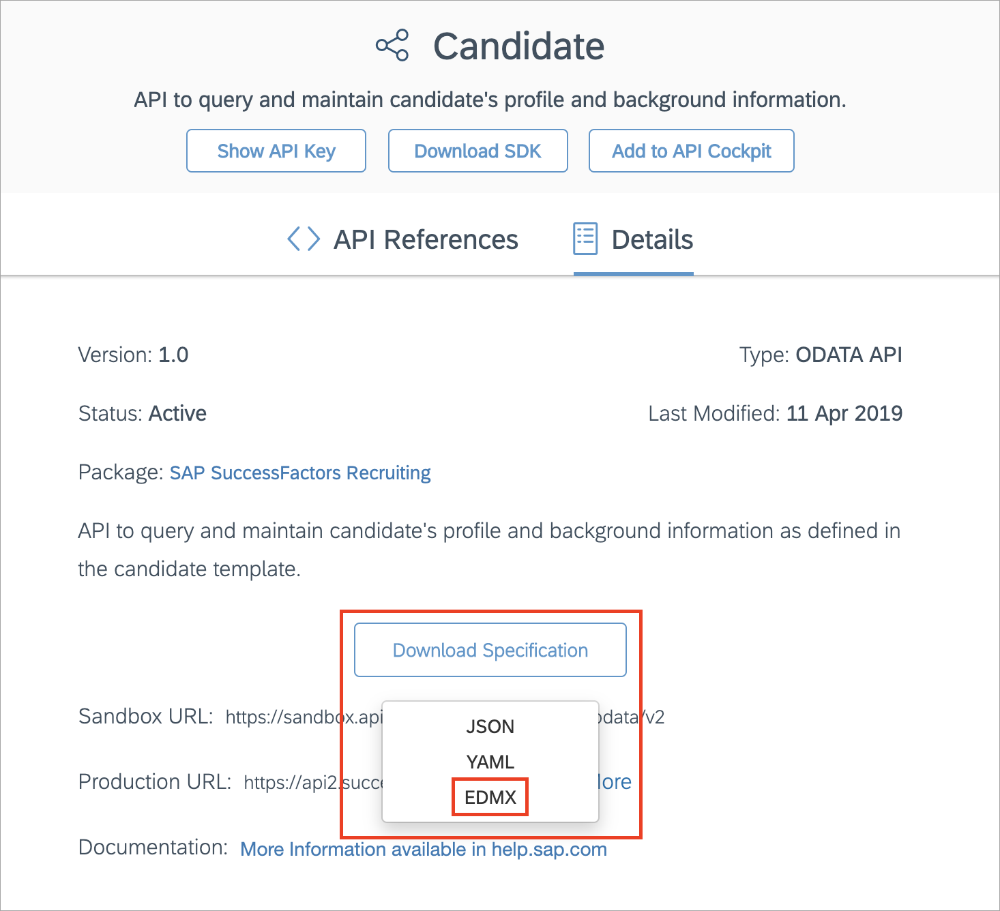

## Details

> ### We migrate tutorials to our [documentation](https://sap.github.io/cloud-sdk/)
> This tutorial is not actively maintained and might be partially outdated.
> Always up-to-date documentation is published on our [documentation portal](https://sap.github.io/cloud-sdk/).
> We will provide a link to the updated version of this tutorial as soon as we release it.
> In this tutorial, version 1 of the SAP Cloud SDK for TypeScript/JavaScript is used.

### You will learn
- What the SAP Cloud SDK offers for easily accessing OData services via its client libraries
- How to generate an OData client library for other services, like SuccessFactors services
- How to use your custom OData client library

The SAP Cloud SDK's OData Virtual Data Model is a set of client code libraries that abstract the SAP S/4HANA exposed OData services. It provides a fluent, type safe and exploratory way of building requests against S/4HANA. For more details, checkout our tutorial group on how to [build an address manager with the SAP Cloud SDK's OData Virtual Data Model](group.cloudsdk-js-vdm), where we covered this topic more extensively.

The goal of this tutorial is to generate your own client code of the same structure for a non-S/4HANA service at the example of a SuccessFactors service.

---

[ACCORDION-BEGIN [Step 1: ](Install the generator)]

The generator is part of the [SAP cloud-sdk-cli](https://github.com/SAP/cloud-sdk-cli). This command line interface provides everything to quickly generate a web project using the SDK. We have a [getting started tutorial](s4sdkjs-getting-started), where we show that. If you have not already done it install the CLI globally using `npm`:

```Shell
npm install -g @sap-cloud-sdk/cli
```

[DONE]
[ACCORDION-END]

[ACCORDION-BEGIN [Step 2: ](Get familiar with non-S/4HANA OData service)]

Take a look at the [SuccessFactors recruiting service for candidates](https://api.sap.com/api/RCMCandidate/resource) on the SAP API Business Hub and get familiar with the entities and possible request structures. In the course of this tutorial we will generate an OData client library for this service and use it to build a query to retrieve data for the `Candidate` entity. Take a look at the capabilities around this entity and the service in general, so that you can compare your generated code later on.



[DONE]
[ACCORDION-END]

[ACCORDION-BEGIN [Step 3: ](Provide service specification files)]

Download the service specification file from the SAP API Business Hub. In the aforementioned `Candidate` service navigate to Details and press `Download Specification`. Choose EDMX to download a file called `RCMCandidate.edmx`. Don't close this page yet, because you will still need it in one of the next steps.



Create a directory `service-specifications` in your project and move the previously downloaded specification to this directory. We will use this directory as input directory for the generation. Feel free to add other specification files, too.

[DONE]
[ACCORDION-END]

[ACCORDION-BEGIN [Step 4: ](Run generation)]

We will use the cloud-sdk-cli now to generate the OData client from the service specification. To find the right command, just run

```Bash
sap-cloud-sdk --help
```
We want to generate an OData client so `generate-odata-client` is the right command for us. Run `sap-cloud-sdk generate-odata-client --help` to see how the command is used.

Only the input and output directory are mandatory:

```Bash
sap-cloud-sdk generate-odata-client -i service-specification/ -o odata-client/
```

Note that the generator relies on the `@sap-cloud-sdk/generator` package. If you have not installed this, on the first run a prompt will appear asking you to install it. The question looks like "Do you want to install the @sap-cloud-sdk/generator globally?". Choose "no" as it will install the `latest` version of the generator, which does not fit this tutorial. You should run the following command to install the `@sap-cloud-sdk/generator` by your own.

```Bash
npm install -g @sap-cloud-sdk/generator@^1.54.0
```

After the generation is finished you should find in the `odata-client` folder multiple generated classes. But also in the `service-specification` folder a new file has been created: `serviceMapping.json`. The file should contain the following content:

```json
{
  "RCMCandidate": {
    "directoryName": "sfo-data-service",
    "servicePath": "VALUE_IS_UNDEFINED",
    "npmPackageName": "sfo-data-service"
  }
}
```

Some service specifications do not specify a service path. The service path is the part of the URL that points to a service. As we do not want to assume any paths, the value will therefore be set to `"VALUE_IS_UNDEFINED"` and has to be replaced manually. You can add a service path in the `service.mapping.json` that was created in your input directory.

Replace the value for `servicePath` with the one for your service. The SAP SuccessFactors services that are available on the SAP API Business Hub have the service path `'/odata/v2'`.

```JSON
{
  "RCMCandidate": {
    "directoryName": "sfo-data-service",
    "servicePath": "/odata/v2",
    "npmPackageName": "sfo-data-service"
  }
}
```

 Now rerun the generation, but make sure to add the `--forceOverwrite` flag to overwrite the previously generated client.

```Shell
sap-cloud-sdk generate-odata-client -i service-specification/ -o odata-client/ --forceOverwrite
```

Congratulations, you have generated the `sfo-data-service` module in your output directory!
By default, the generated module contains the following sources:

  * TypeScript code (`.ts`)
  * Transpiled JavaScript code (`.js`)
  * Type definition files (`.d.ts`)
  * Source map files (`.js.map` and `.d.ts.map`)
  * `.npmrc`
  * `package.json`
  * `typedoc.json`
  * `tsconfig.json`

Depending on which of those files you need, you can skip the generation of most of those. To find out how and for further options, checkout `sap-cloud-sdk generate-odata-client --help`.

[DONE]
[ACCORDION-END]

---
